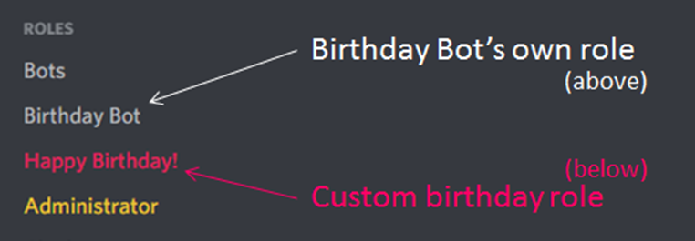
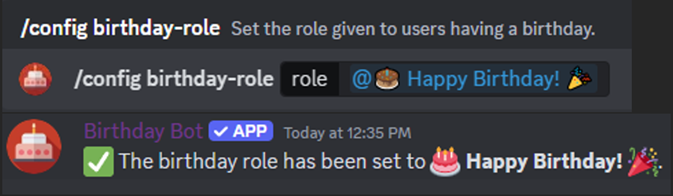
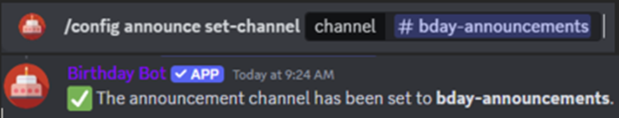
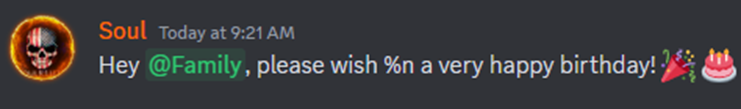
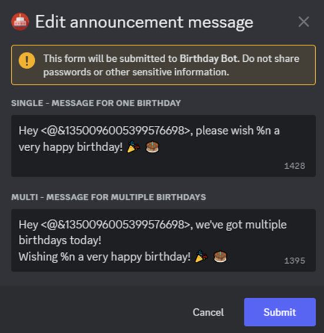

# Frequently Asked Questions
<small>Last updated on 2026-07-02 14:30 PST 
<small>Huge thanks to Mitzi_13 and Soul for contributing to the structure and content of the FAQ!</small>

## Permissions
### Recommend permissions:
- View Channels
- Manage Roles
- Send Messages
- Embed Links
- Attach Files

### Additional permissions (optional):
- Mention `@everyone`, `@here`, and All Roles - If you want to tag these in your birthday announcement.
- Send Messages (channel-specific) - To override individual channel permissions.

## Commands
### Help Commands
- `/help` - Shows general information about each command.
- `/config announce help` - Shows information on setting up the announcement message.

### Relevant for setup
- `/config announce set-channel`
  - Set the channel the bot will post the birthday announcements. Leave blank to disable announcements.
- `/config announce set-message`
  - Opens a window for creating or editing a custom announcement message.
- `/config announce set-ping`
  - Sets whether the `%n` in your announcement message will simply show name(s) or ping member(s).
- `/config birthday-role`
  - Sets the role to be given to members having a birthday. Must be set up ahead of time; see further below.
- `/config set-timezone`
  - Sets the default time zone for your server - the implied time zone if a user doesn't add their own. If left blank, the default is UTC/GMT.
### Other commands for bot administration
By default, members need the "Manage Server" permissions to run these. This can be changed through your server's "Integrations" settings.
- `/export-birthdays`
  - Generates a file with all birthdays saved in your server.
- `/override remove-birthday`
  - Removes a member's birthday on their behalf.
- `/override set-birthday`
  - Sets a member's birthday on their behalf.
- `/override set-timezone`
  - Sets a member's time zone on their behalf.
### Testing and troubleshooting
- `/config check`
  - Gives some diagnostic information and tests its permissions.
- `/config announce test`
  - Sends an announcement message to the announcement channel immediately with a given name or set of names.
- `/config announce timers-reset`
  - Resets the bot's internal state for the server. This may make the bot reannounce the day's birthdays, remove the roles of those whose birthdays ended recently, or fix other obscure issues.
### General commands
- `/birthday get`
  -# Gets the birthday of the member specified. Leaving the user blank will return your birthday.
- `/birthday remove`
  -# Removes your birthday information from this bot, in that server.
- `/birthday set date`
  -# Sets or updates your birthday.
- `/birthday set timezone`
  -# Sets or updates your time zone, if you have a birthday set.
- `/birthday show-nearest`
  -# Shows a list of members who had a birthday in the last 7 days and/or in the next 14 days.

## Questions
### Why isn't the bot replying to the help commands?
- Check to make sure the bot has the correct [permissions](#recommend-permissions) for both the server and the channel you ran the command in.
- Make sure the bot is online. If the bot is online in one server and offline in another, try to kick the bot from your server and re-invite it. It will retain all previously set settings and birthdays.
  - If the bot is offline everywhere and no one has said anything in the support server, ping the owner to let them know. (Don't spam please.)
- Ensure you have the correct Birthday Bot.
  - Verify that its profile picture is primarily *red*.
  - A different Birthday Bot exists with a primarily *blue* picture. There is absolutely **no relation** between this bot and that one. For their contact information, you could try checking [their Top.gg page&nbsp;<svg xmlns="http://www.w3.org/2000/svg" width="1em" height="1em" viewBox="0 0 24 24"><path fill="currentColor" d="M14 3v2h3.59l-9.83 9.83l1.41 1.41L19 6.41V10h2V3m-2 16H5V5h7V3H5a2 2 0 0 0-2 2v14a2 2 0 0 0 2 2h14a2 2 0 0 0 2-2v-7h-2z"/></svg>](https://top.gg/bot/656621136808902656).

### What is the birthday role?
This is a custom role that you create with a name and color of your choice. If set, Birthday Bot can automatically assign it to a member when it is their birthday, and remove it when the birthday is over.
#### How do I set up the birthday role?
- Create a new role in your Server Settings with these factors in mind:
  - The custom role should be dedicated to the Birthday Bot's use only. Do not use an existing role that already has users with the role, the bot will remove the role from those users.
  - Make sure the "Birthday Bot" role is **higher** in the role list than your new custom role.
  - While not required, you may want to set the new birthday role higher than most/all other roles so that the custom color stands out on someone's birthday, and/or turn on the "Display role members separately from online members" setting.

- Next, set the new role with the command `/config birthday-role`

### What is the birthday announcement?
After the Birthday Bot assigns the custom birthday role to a member, it can also post a message/announcement.

#### How do I set up the birthday announcement?
- First, use the command `/config announce set-channel` to tell the bot where to post.
  - Note: Running this command with the channel set to nothing will disable the birthday announcement.

- Next, type out your birthday message exactly as you want it to appear - emojis, pings, formatting, and all. Use `%n` to list the name(s) of the members having a birthday.
  - Note: the current character limit is 1500.
  - If you intend to ping a role, consider using a private or dedicated channel for announcements to avoid pinging members excessively.

- After you have made your message, copy the text.
  - This is usually done on mobile by long pressing the message and pressing the "copy text" popup.
  - This is usually done on desktop or browser by right clicking the message and clicking the "copy text" popup.
- Use the command `/config announce set-message`
- In the window that pops up, you will see the default messages for "Single" and "Multi" birthdays.
  - Note: In the "Multi" birthday message, you only need to include **%n** once. It will list all members having a birthday.
- Paste in your copied text into the appropriate line and hit "Submit".
  - Any time you run `/config announce set-message`, it will show you what is currently set as the message, so don't worry if you lost what you wrote earlier!

#### When will the bot post the birthday announcement?
At midnight of the appropriate time zone. The bot decides the time zone to use based on whether certain pieces of information exist.
* **First priority**: Does the individual have a time zone set (with `/birthday set timezone` or `/override set-timezone`)?
* **Second priority**: Does the server have a default time zone (set with `/config set-timezone`)?
* **Otherwise**, use universal time (UTC).

See [below](#what-time-zones-can-i-use) for more information on time zones.

#### What if I want the announcement to post at a different time besides midnight?
You can offset the announcement time by setting the default time zone to a different one. For example, if you want the message to post at 8am, use a time zone that would be midnight there when it is 8am where you live.

### What time zones can I use?
This bot only accepts time zone names from the IANA Time Zone Database (a.k.a Olson Database). The reason for its existence is for technical reasons, but it is essentially a standard way to describe a time zone.

The following links may be helpful for finding a zone:
- [tz by xSke&nbsp;<svg xmlns="http://www.w3.org/2000/svg" width="1em" height="1em" viewBox="0 0 24 24"><path fill="currentColor" d="M14 3v2h3.59l-9.83 9.83l1.41 1.41L19 6.41V10h2V3m-2 16H5V5h7V3H5a2 2 0 0 0-2 2v14a2 2 0 0 0 2 2h14a2 2 0 0 0 2-2v-7h-2z"/></svg>](https://xske.github.io/tz/): Detects your device's time zone and allows you to quickly copy it for pasting later.
  - Suggested by **ankh**
- [Time Zone Picker by Arilyn Bots&nbsp;<svg xmlns="http://www.w3.org/2000/svg" width="1em" height="1em" viewBox="0 0 24 24"><path fill="currentColor" d="M14 3v2h3.59l-9.83 9.83l1.41 1.41L19 6.41V10h2V3m-2 16H5V5h7V3H5a2 2 0 0 0-2 2v14a2 2 0 0 0 2 2h14a2 2 0 0 0 2-2v-7h-2z"/></svg>](https://zones.arilyn.cc/): Shows all other time zones by their geographic boundaries. Great for finding someone else's zone.
  - Suggested by **VG007ukEUxbox**

For the complete list of time zone names, refer to the [table on Wikipedia<svg xmlns="http://www.w3.org/2000/svg" width="1em" height="1em" viewBox="0 0 24 24"><path fill="currentColor" d="M14 3v2h3.59l-9.83 9.83l1.41 1.41L19 6.41V10h2V3m-2 16H5V5h7V3H5a2 2 0 0 0-2 2v14a2 2 0 0 0 2 2h14a2 2 0 0 0 2-2v-7h-2z"/></svg>](https://en.wikipedia.org/wiki/List_of_tz_database_time_zones). Not all names in the full list are recognized by the bot.

#### Most popular time zone options:
> - **America/New_York** - US Eastern Time (observes DST)
> - **Europe/London**, **Europe/Dublin** - GMT/WET with BST/WEST during summer
> - **America/Chicago** - US Central Time (observes DST)
> - **America/Los_Angeles** - US Pacific Time (observes DST)
> - **Europe/Paris**, **Europe/Berlin**, **Europe/Amsterdam**, or **Europe/Stockholm** - Central European Time
> - **Australia/Sydney** or **Australia/Melbourne** - Covers NSW, TAS, VIC, ACT, JBT (+10, +11 DST)
> - **Asia/Singapore**
> - **Asia/Manila** - Phillipines
> - **Asia/Kolkata** - All of India
> - **Australia/Brisbane** - Covers Queensland (+10, no DST)

### I set the wrong birthday, announcement, time zone, etc. How do I change it?
Run the command again. There is no limit to how often you can update your config. The exception is users modifying their birthdays in any way if *add-only mode* has been enabled.

### What does the `/config check` message mean?
**`Diagnostics`** 
The information in this section gives the bot owner some information to look deeper into the issue, if necessary. It normally isn't useful for server owners or moderators.
- `Bot shard`: The specific network connection ID by which the bot is communicating with your server.
- `Members`: Total number of members in your server.
- `Birthdays registered`: Amount of members that have birthdays added on your server, regardless if the members are still in the server or not.
- `Users in cache`: The number of users whose information the bot currently has loaded in memory.
- `Background cache eligibility`: The number of members that the bot currently believes it should keep in cache at all times. This is normally used for those who are about to have or have recently had birthdays.

**`Validation`** 
- `Default server time zone`: See [this section on birthday announcements](#when-will-the-bot-post-the-birthday-announcement).
- `Birthday role` and `Announcement channel`:
  - `Set to`: Attempts to show a direct link to the role/channel set. If it is not displaying properly, check your configuration or your own permissions.
  - `Exists`: Shows if the bot was able to confirm for itself that the role/channel exists. If this is failing, the old role/channel may have been deleted.
  - `Bot has permission to use`: If this is failing, see [this section on role setup](#how-do-i-set-up-the-birthday-role).
